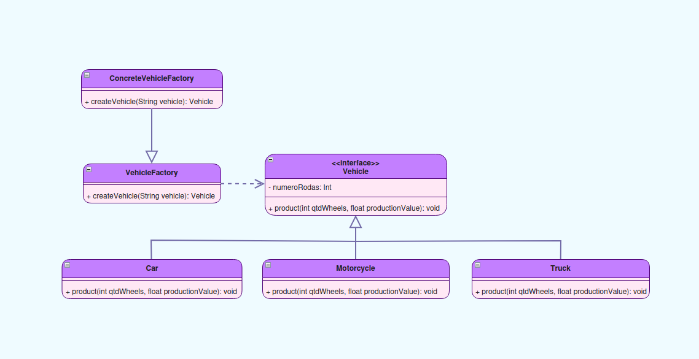

### Class Diagram



### Class VehicleFactory

```Java
public interface VehicleFactory {
    Vehicle createVehicle(String vehicle);
}
```

### Class Vehicle

```Java
public interface Vehicle {
    public void product(int qtdWheels, float productionValue);
}
```

### Class ConcreteVehicleFactory

```Java
public class ConcreteVehicleFactory implements VehicleFactory {

    @Override
    public Vehicle createVehicle(String Vehicle) {
        switch (Vehicle){
            case "Car":
                return new Car();
            case "Truck":
                return new Truck();
            case "Motorcycle":
                return new Motorcycle();
            default:
                System.out.println(Vehicle + "Can not be created!");
                return null;
        }
    }
}
```

### Class Truck

```Java
public class Truck implements Vehicle {
    @Override
    public void product(int qtdWheels, float productionValue) {
        System.out.println("Caminhão com " + qtdWheels + " rodas, e com valor de produção de: R$ " + productionValue);
    }
}
```

### Class Car

```Java
public class Car implements Vehicle {
    @Override
    public void product(int qtdWheels, float productionValue) {
        System.out.println("Carro com " + qtdWheels + " rodas, e com valor de produção de: R$ " + productionValue);
    }
}
```

### Class Motorcycle

```Java
public class Motorcycle implements Vehicle {
    @Override
    public void product(int qtdWheels, float productionValue) {
        System.out.println("Moto com " + qtdWheels + " rodas, e com valor de produção de: R$ " + productionValue);
    }
}
```

### Class Main

```Java
public class Main {
    public static void main(String[] args) {
        VehicleFactory factory = new ConcreteVehicleFactory();

        Vehicle car = factory.createVehicle("Car");
        car.product(4, 35000);

        Vehicle truck = factory.createVehicle("Truck");
        truck.product(6, 50000);

        Vehicle motorcycle = factory.createVehicle("Motorcycle");
        motorcycle.product(2, 25000);
    }
}
```
